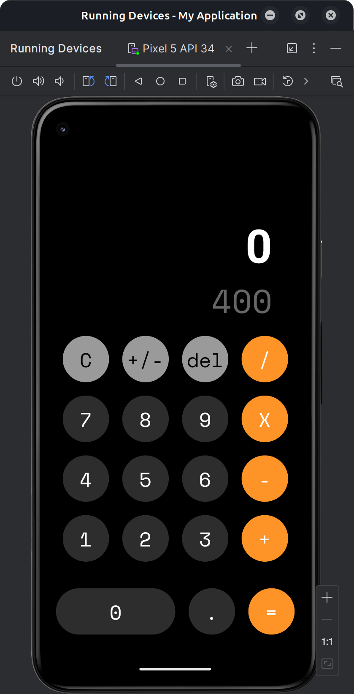

# Welcome to my first Expo app - CalculatorAPP 👋

CalculatorAPP is a simple and intuitive calculator application built using React Native and Expo. This app supports basic arithmetic operations and provides a clean and user-friendly interface.

## Features

- Basic arithmetic operations: addition, subtraction, multiplication, and division.
- Clear button to reset the calculator.
- Toggle button to switch between positive and negative numbers.
- Responsive design that works on both iOS and Android devices.

## Screenshots



## Installation

To run this project locally, follow these steps:

1. Clone the repository:
    ```sh
    git clone https://github.com/AlanMelendez/calculator-app.git
    ```
2. Navigate to the project directory:
    ```sh
    cd calculator-app
    ```
3. Install the dependencies:
    ```sh
    pnpm install
    ```
4. Start the Expo development server:
    ```sh
    pnpm start
    ```

## Usage

Once the development server is running, you can use the Expo Go app on your mobile device to scan the QR code and launch the application.

## Contributing

Contributions are welcome! Please open an issue or submit a pull request for any improvements or bug fixes.

